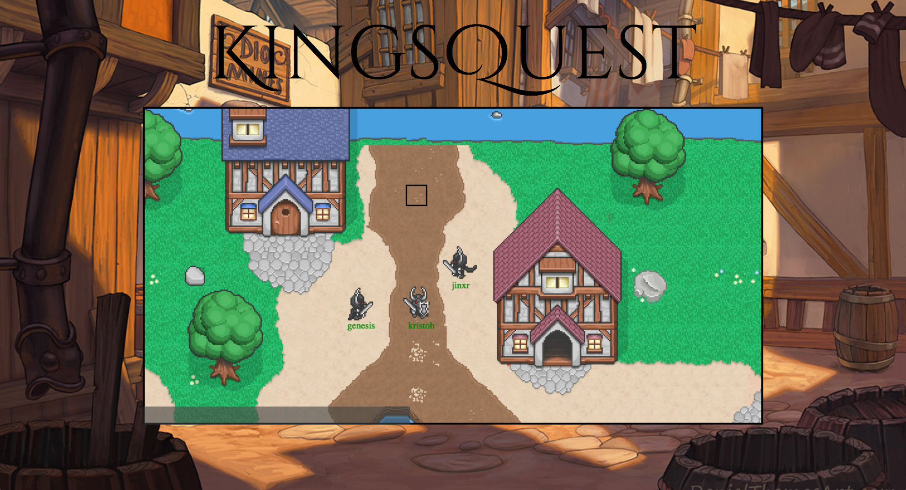

# About KingsQuest

KingsQuest is a multiplayer video game developed for the web

### Tools Used

- Frontend: Angular for the user creation page and the Phaser game engine.

- Backend: Express.js for the backend API and SocketIO for multiplayer connectivity.

### Features

- User creation
- Chat system for player interaction
- NPC interaction
- Click-based player movement system utilizing a pathfinding algorithm with collision detection
- Teleportation

